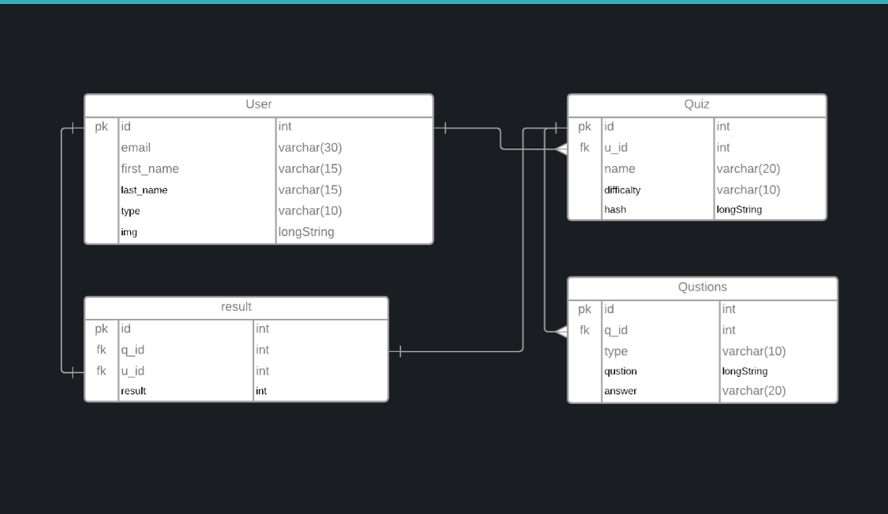
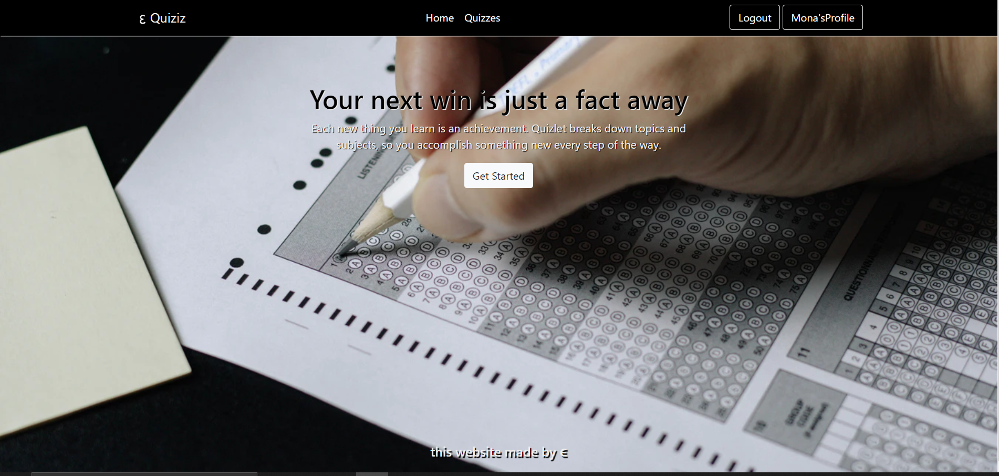
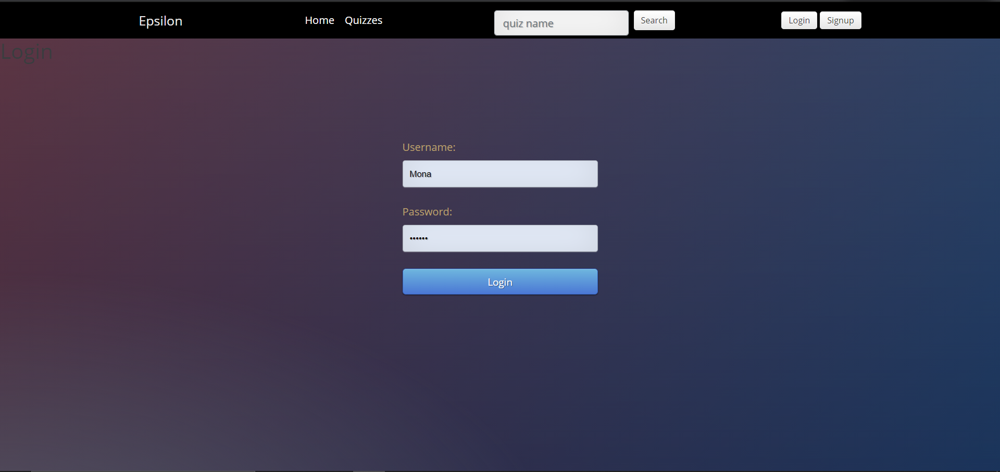
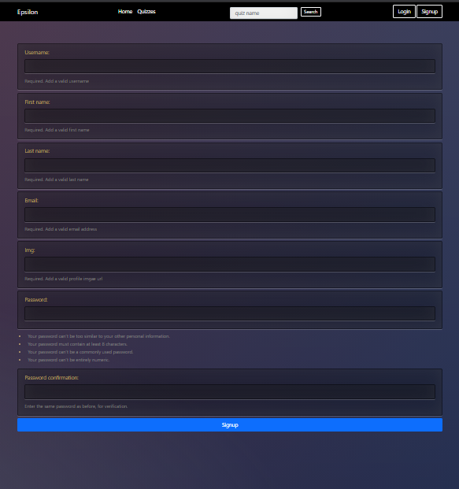
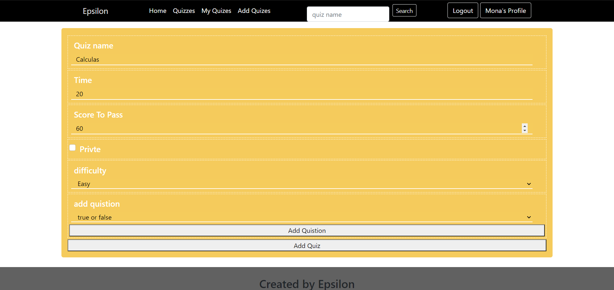
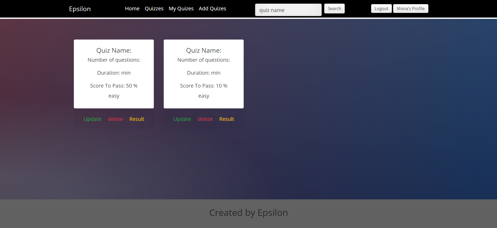
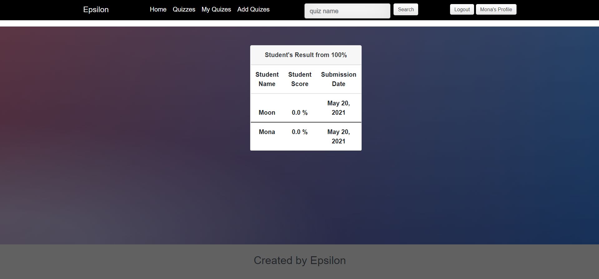

# Quiz-project

Epsilon quiz is an online quiz maker that is designed with teachers in mind. It is easy to use a one-stop solution that provides tools for the creation, distribution, and analysis of quizzes,  and online surveys. Users can create their own quizzes and share with other wither the users or teachers students .
After designing your quiz you gather results in an informative dashboard after the test is completed. Moreover, created quiz and the you want to delete? You can do too.

# User Story
 *   User should be able to requester ,login and logout. 
 *   User should be able to see her/his profile and can update it 
 *   User should be able to delete the quizzes she/he created 
 *   User can take the same quiz several time ,and the just last result will store .
 *  Upon submitting an answer, users should receive textual feedback about their answer. If they were incorrect, they should be told the correct answer.

*   Users should be able to start a new quiz.

# technologies used
*   Django
*   sqlite
*   postgres
*   VSC
*   python
*   zoom
*   slack
*   Git/GitHub 
# Our Models

# Demo for the website
*   you will start with home Page!
you can create a new account or login if you have one

*   login page 

*   signin page 

if you login or created a new account that all what you need to start to add quizzes ,take quizzes, delete quizzes that you have created and see the result for the people who submit on your quiz

*   add quiz page

*   list of you quizzes you have been craeted

*   people's results who submitted to your quiz

